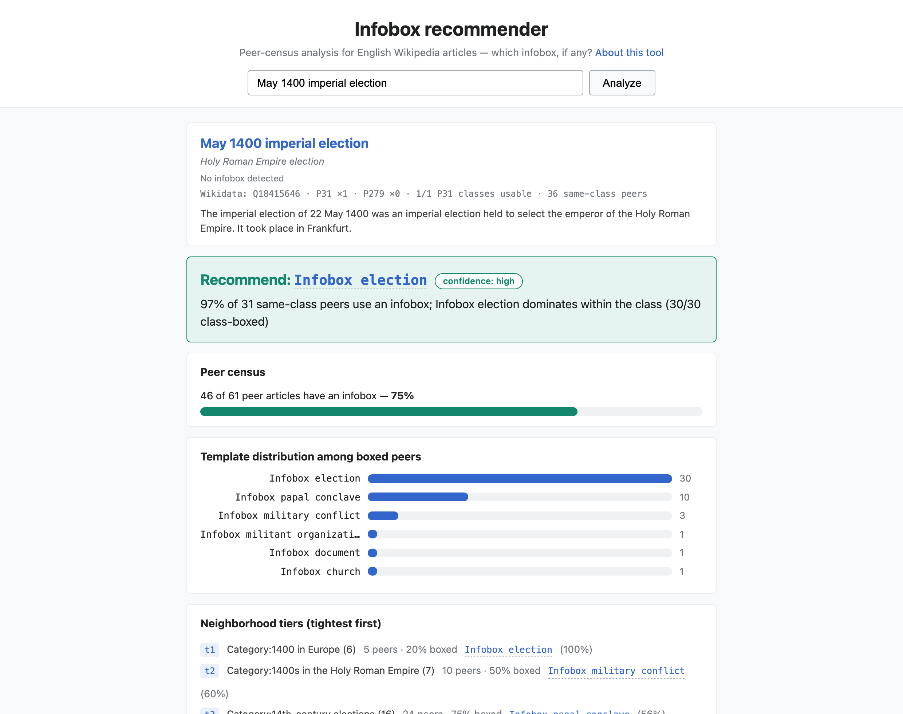
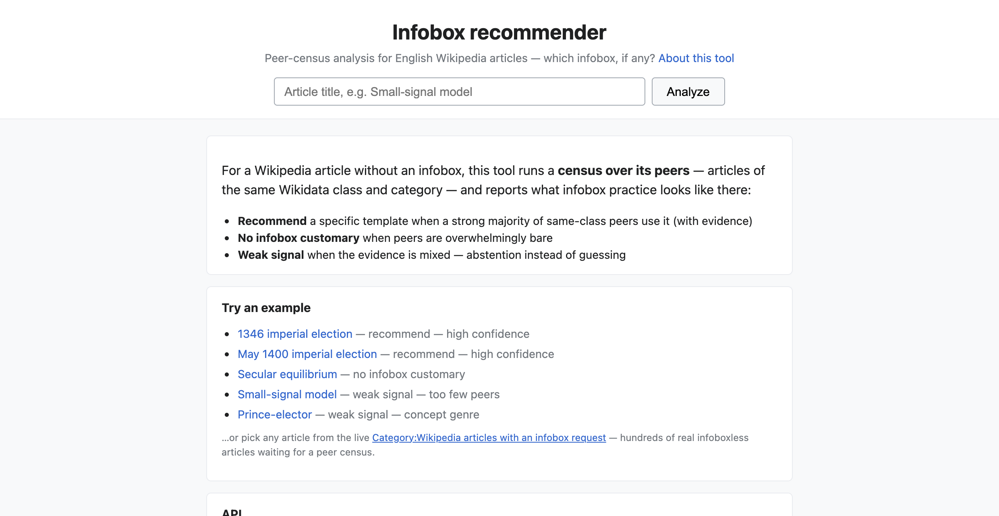

# infobox-recommender

**For a Wikipedia article with no infobox: should it have one — and if so, which template?**

Rather than guessing from the article itself, it runs a **census over the
article's peers** — articles of the same Wikidata class and closest categories
— and reports what infobox practice actually looks like there, with the
evidence attached.

**Live tool: <https://infobox-recommender.toolforge.org>** · CLI + JSON API · MIT

**In the wild:** editors reach it through **Lead Balancer**, a lead-review user
script whose infobox tab calls this service for articles that lack an infobox
([source](https://en.wikipedia.org/wiki/User:Sadads/LeadBalancer-core.js)); the
first ~70 analyses and 2 subsequent infobox additions by named editors are
recorded in [`usage-history.md`](usage-history.md).

[](https://infobox-recommender.toolforge.org/?title=May+1400+imperial+election)

*(Screenshot: a live report — click to open it.)*

## What it tells you

Three verdicts, always with the evidence:

| Verdict | What it means |
|---|---|
| **Recommend {{Infobox X}}** | A strong majority of peers use that specific template — e.g. 30 of 30 class-boxed imperial elections use {{Infobox election}} |
| **No infobox customary** | Peers are overwhelmingly bare; adding one would make this article the outlier (e.g. 1% of trace-fossil articles are boxed) |
| **Weak signal** | The evidence is mixed or too thin, so it abstains and points you to the WikiProject banner instead of guessing |

Every report shows the peer count, how many peers carry an infobox, the
template distribution, neighborhood tiers, and examples of boxed and bare
peers — so an editor can weigh the argument themselves. Wikipedia's
[Manual of Style](https://en.wikipedia.org/wiki/Wikipedia:Manual_of_Style/Infoboxes)
explicitly counts "similar articles do or don't have infoboxes" as a
legitimate consensus argument (MOS:INFOBOXUSE); this tool produces exactly
that evidence. **It never edits articles and never decides — a human does.**

**Article already has an infobox?** *Validate mode* checks whether the
existing choice matches peer practice: **consistent**, **atypical**
(peers differ), or **inconclusive**.

## Try it

**Web** — <https://infobox-recommender.toolforge.org> — type any article
title, or start from a one-click example.



The home page also links the live
[Category:Wikipedia articles with an infobox request](https://en.wikipedia.org/wiki/Category:Wikipedia_articles_with_an_infobox_request)
— the backlog this tool was built for, with hundreds of real infoboxless
articles — and offers a **🎲 random article** button
([`/random`](https://infobox-recommender.toolforge.org/random)) that jumps
straight into an analysis of one of them.

**Validate an existing infobox:** add `&validate=1` to a report URL, or use
the button in the report.

**Command line** (Node ≥ 18):

```sh
node cli.js "May 1400 imperial election"    # full pipeline, human summary
node cli.js "Abraham Lincoln" --validate    # check an existing choice
node cli.js "A" "B" "C" --json              # machine-readable
npm run serve                               # web UI at localhost:3000
```

**JSON API:** `GET /analyze?title=ARTICLE&output=json` — CORS-enabled, no
tokens or keys, full evidence (missing title → 400). Per-client limits are
generous (150 analyses / 15 min, 40/min burst) and throttled requests come back
as 429 with `Retry-After`; see [`ARCHITECTURE.md`](ARCHITECTURE.md#web-service).

**Usage stats:** `GET /stats` — how much the tool is used and what it
recommends (aggregate, privacy-preserving; `?output=json` for
machine-readable). What is and isn't collected: [PRIVACY.md](PRIVACY.md).

A first analysis makes a few dozen live API calls, paced politely — one wave of
at most four requests per second per Wikimedia service
([details](ARCHITECTURE.md#performance--caching)) — so a heavy article is
~10–25s cold. Everything is disk-cached, so repeat and overlapping analyses are
much faster (usually instant).

## How well does it work?

Evaluated on an **88-case corpus** — 57 articles from the infobox-request
backlog whose editor-chosen infobox is the gold label, plus 31 curated cases
(doc-backed demos and canonical sets such as presidents, states, foods, and
TV episodes):

> **57 pass · 6 near-miss or defensible disagreements · 25 honest abstentions
> — 90% accuracy on decisive verdicts.**

Abstention is the designed answer in the ambiguous middle band, not a
failure. Four of the six disagreements are cases where the peer evidence
arguably outweighs a single editor's choice. Per-case results, corpus
construction, and failure analysis: **[`test/EVALUATION.md`](test/EVALUATION.md)**.

Honest caveats: this is a research-grade POC, not an authority. Known gaps
(no template specificity ladder, noisy categories, no draft-preview yet) are
listed under *Known limitations* in [`ARCHITECTURE.md`](ARCHITECTURE.md#known-limitations),
with priorities in [`ROADMAP.md`](ROADMAP.md).

## Why this tool exists

"Which infobox?" is a documented, still-unserved gap. Help:Infobox offers
exactly two methods — browse ~2,000 templates, or copy one from a similar
article; the 2017 Community Wishlist "Infobox wizard" was investigated by the
WMF but shipped only template *insertion* by name; and the newest WMF tooling
(Microtask Generator, 2026) flags "add an infobox" as a task while telling you
to "find similar articles to copy template structure". This tool automates
that step — the peer census is "find a similar article" done systematically.

The evidence, user stories, and prior-art check are in
**[`status-quo.md`](status-quo.md)**.

## How it works

Peers come from three signals: Wikidata **P31 (instance-of) siblings**, the
article's **most specific categories**, and **WikiProject banners**. Every
peer's template list is fetched and counted; a decision layer then applies
coverage and dominance thresholds, with a tiered rescue for thin evidence and
honest abstention in the middle band.

Technical detail — peer discovery, census batching, the primary-infobox
selection rules, dual-runtime design, and the web service — is in
**[`ARCHITECTURE.md`](ARCHITECTURE.md)**. API gotchas are in
[`engineering-notes.md`](engineering-notes.md).

## Docs

| Doc | Contents |
|---|---|
| `ARCHITECTURE.md` | How the pipeline works — discovery, census, selection rules, runtime design, web service |
| `test/EVALUATION.md` | Evaluation — corpus construction, scoring, per-case results, failure analysis |
| `status-quo.md` | The documented need — how editors add infoboxes today, friction, prior art, market assessment |
| `usage-history.md` | Early usage & adoption record — the first 70 analyses (Aug–Oct 2026), how the traffic arrived, and what happened next |
| `ROADMAP.md` | What's next, prioritized, with effort estimates and eval targets |
| `PRIVACY.md` | What usage data is collected, what is never collected, and retention |
| `HANDOFF.md` | Status, quick start, deployment recipe, open threads |
| `infobox-recommendation.md` | Original research — guidance, backlog, tool landscape, algorithm spec |
| `wikiprojects-and-i18n.md` | Cross-edition measurement — infobox naming and WikiProjects across 20 Wikipedia editions, and what porting would take |
| `infobox-naming.md` | Infobox template naming across 20 language editions (method, tables; raw data in `infobox-naming.json`, scripts in `scripts/research/`) |
| `signals.md` | Signal landscape & hypotheses — what finds "birds of a feather" |
| `engineering-notes.md` | API gotchas + methodology lessons — read before touching the API layer |

## Tests

```sh
npm test          # 25 unit tests: primary-infobox selection, usage-log privacy
                  # and retention, rate limiting, random-article picker
npm run eval       # full evaluation over the corpus (warm cache: <1s)
npm run fixtures   # rebuild test/fixtures.json from the live backlog
```

Research scripts (cross-edition infobox naming, the early-usage/adoption
analysis, and the `prop=templates` phantom-box audit) live in
[`scripts/research/`](scripts/research/), documented in
[`usage-history.md`](usage-history.md) and [`infobox-naming.md`](infobox-naming.md).
Latency is measured per request with `scripts/bench-analysis.mjs`
(`--full` for the census path, `--cached` for warm runs).

## Deployment

Live on Toolforge (Kubernetes, `node20`) at
<https://infobox-recommender.toolforge.org>. The k8s node type serves the app
from `~/www/js/` and runs `npm start` — so `package.json` must declare its
`start` script. The redeploy recipe, the verify-a-deploy checklist, and the
entry-point pitfall that cost us weeks are in
[`HANDOFF.md`](HANDOFF.md#5-deployment-toolforge).

## License

MIT — see [`LICENSE`](LICENSE).
